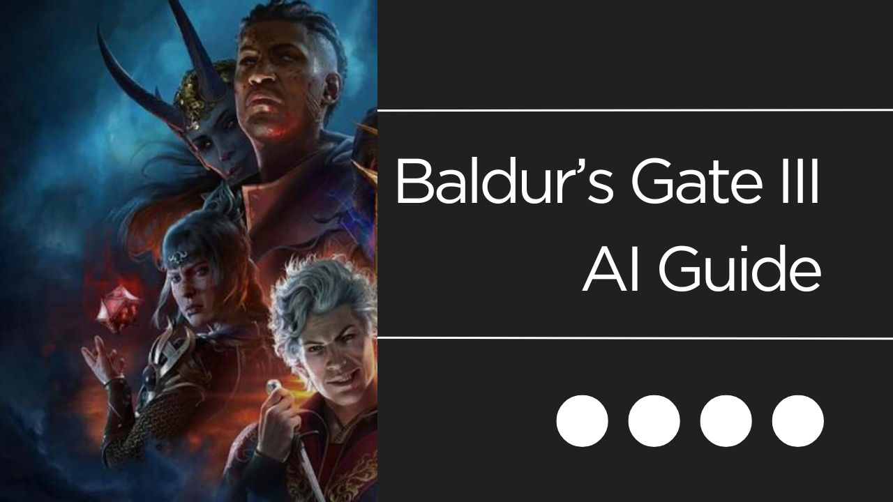

# Baldur's Gate 3 AI Guide

As you travel through Faerûn, bring this trusted AI guide with you for tips when you're stuck.

## Use cases

- If you're stuck at any point in the game, pop this open and ask away. Better than Googling.

- If you're curious about the lore, companions or NPCs, this is the quickest way to get answers.

- If you're fighting a boss and not sure how to beat them, well, inquire for a hint.

## Source materials

- Documents are copied by hand from [Baldur's Gate III Wiki](https://baldursgate3.wiki.fextralife.com/Baldur's+Gate+3+Wiki)

## Technical details

- Query engine in Llama Index, documents are loaded and embedded into FAISS (initially used Chroma, but had SQLite compatibility issues on Streamlit). Streamlit frontend, and optional Supabase for logging messages.

## Future plans

- Add support for local mode (local LLMs and embeddings)

- Add build and mod guides
